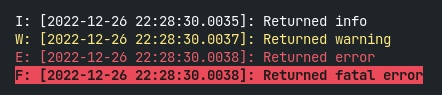

Colored GoLang Logger
========================
Preamble
------------------------
This module is a simple and minimalistic logger for GoLang projects.
It supports displaying the date, time, and color for each kind of message, such as:

* Info
* Warning
* Error
* Fatal error

This is an independent module, it does not require installation of additional dependencies, which will keep your project **clean**.

Usage
-----------------------
Import package:

    import log "github.com/ckompadre/go-logger"

Using methods:

    log.Info("Returned info")
	log.Warning("Returned warning")
	log.Error("Returned error")
	log.Fatal("Returned fatal error")

Output:

Install
-----------------------

    go get github.com/ckompadre/go-logger
